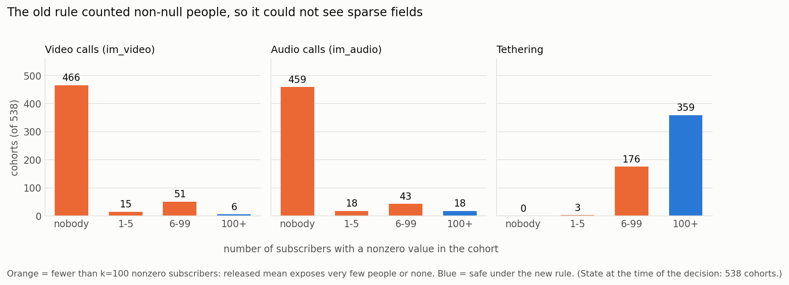
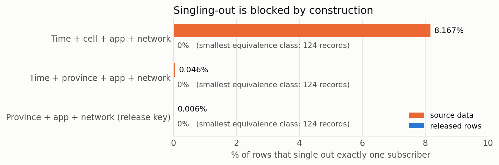
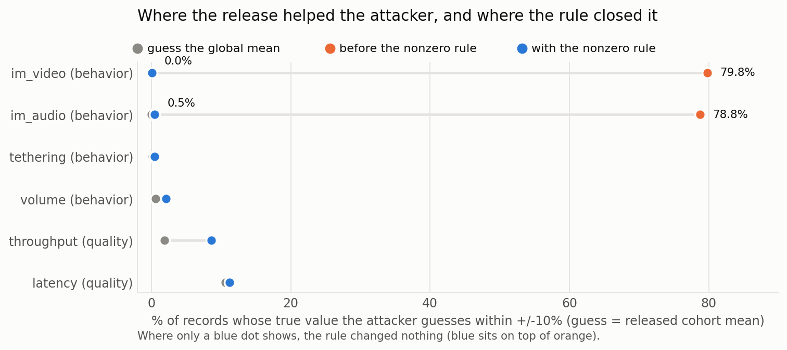
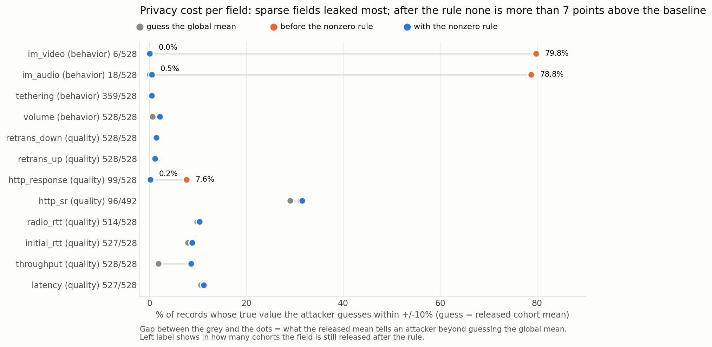
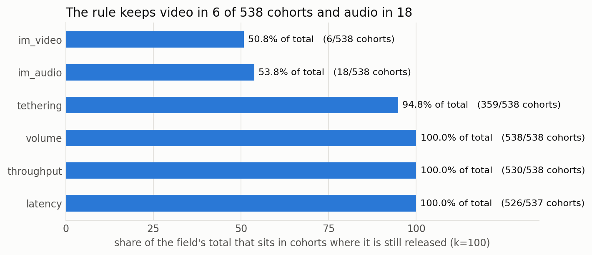
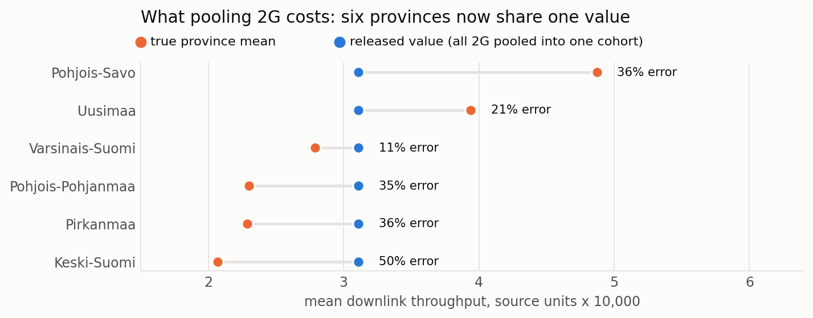
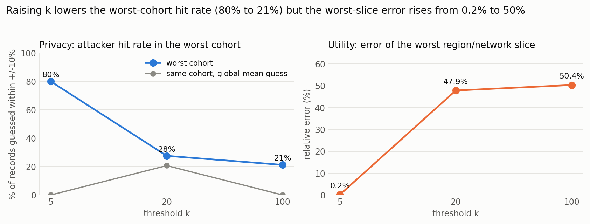

# Monitoring · SisuNymous

**Privacy-preserving release of telecom cohort data with simulated privacy attacks**

Live: **https://fip-195-148-31-126.kaj.poutavm.fi:8790/**

Submit a RAN dataset in `.parquet` format. SisuNymous aggregates subscribers into cohorts with a minimum size of 100 subscribers and publishes only aggregate statistics. The monitoring interface provides regional views of **video traffic, energy consumption, network coverage, and mobility**.

SisuNymous answers questions using only the anonymised release.


> **Note:** All numerical results presented below are based on a fabricated Elisa dataset. They do not represent real Elisa subscribers, traffic, or network conditions.

## Summary

SisuNymous transforms subscriber-level telecom data into aggregate statistics for analysis while reducing the risk of re-identification and attribute inference.

The evaluation uses a fabricated dataset containing **1,099,340 records from 199,195 subscribers**. Subscribers are grouped into non-overlapping cohorts, and the release contains cohort-level statistics rather than individual records.

The primary privacy mechanism is **k-anonymity with k = 100**. We additionally introduce a **nonzero-support threshold** for sparse numeric fields. This addresses a limitation of applying a standard k-anonymity check to telecom usage data: a cohort may contain at least 100 subscribers while only a small number of them contribute non-zero values to a particular metric.

The nonzero-support rule requires at least 100 subscribers with a value greater than zero before a sparse field is released for a cohort. We evaluate this mechanism using simulated singling-out, attribute-inference, and differencing attacks.

For the fabricated dataset, the nonzero-support rule reduces the simulated inference hit rate for sparse usage fields from approximately 79% to the level of the corresponding baseline.

## Problem

Telecom operators process detailed subscriber-level data containing information such as:

- Subscriber location
- Radio access technology
- Application category
- Data volume
- Throughput
- Latency
- Network quality indicators

These measurements are useful for analysing network performance and service quality across geographic areas. However, releasing subscriber-level records can expose information about individual subscribers.

A common approach is to aggregate subscribers into groups and publish statistics such as cohort means. However, group size alone does not guarantee that every published statistic is sufficiently protected.

This is particularly relevant for **sparse telecom metrics**, where most subscribers have zero activity and only a small fraction contribute non-zero values.

## Approach

SisuNymous removes direct and quasi-identifying fields that are not required for the aggregate release, including:

- MSISDN
- IMSI
- IMEI
- Cell ID
- Timestamps

Subscribers are then grouped using:

- Province
- Radio access technology
- Application category

For each cohort, the system can publish aggregate statistics such as:

- Mean throughput
- Mean latency
- Mean data volume

Each released cohort contains at least **100 distinct subscribers**.

### Cohort pooling

Some combinations of province, RAT, and application category contain fewer than 100 subscribers. These cohorts are progressively pooled to satisfy the minimum cohort size.

The pooling hierarchy is:

1. Merge application categories
2. Merge into a combined application category
3. Pool sparse provinces into **Other provinces** within the same RAT

The final release forms a **single non-overlapping partition** of the source population. This is important when evaluating potential differencing attacks.

### Nonzero-support threshold

The main extension to standard k-anonymity is a nonzero-support requirement.

A numeric field is released for a cohort only if at least **100 distinct subscribers have a value greater than zero** for that field.

If fewer than 100 subscribers contribute a non-zero value, the field is withheld for that cohort.

This provides a stronger condition than simply requiring 100 subscribers in the cohort:

> At least 100 subscribers must contribute to the published statistic.

## Sparse-Data Blind Spot

Standard k-anonymity can be insufficient for sparse telecom usage metrics.

In the fabricated dataset:

- **99.7%** of video-usage values are zero
- **98.9%** of audio-usage values are zero
- Only **3,388 subscribers** have non-zero video usage

A conventional k-anonymity check based only on cohort size can therefore accept a cohort containing 100 or more subscribers even when only a small number contribute to the published usage statistic.

For example, a cohort can contain 100 subscribers while only a few subscribers have non-zero video traffic. Publishing the cohort mean can therefore reveal information about those few contributors.

The nonzero-support threshold addresses this case by requiring at least 100 non-zero contributors before the field is released.



## Privacy Evaluation

The privacy evaluation uses three simulated attack models.

### Tier 1 — Singling Out

The first test evaluates whether an attacker can isolate a subscriber using quasi-identifying attributes.

In the source dataset, **8.167% of records** can be singled out using the simulated signature:

> time + cell + application + network

In the released dataset, the corresponding rate is **0%**.

The smallest released cohort contains **124 subscribers**.



### Tier 2 — Attribute Inference

The second test evaluates whether knowledge of a subscriber's cohort provides information about an individual attribute.

The simulated attacker:

1. Identifies the cohort containing the target subscriber.
2. Uses the published cohort mean as the estimate of the subscriber's value.
3. Compares the estimate with the actual value.
4. Measures the fraction of estimates within a specified relative-error threshold.

The result is compared with a baseline attacker that uses the global mean.

The evaluation uses relative-error thresholds of **10%, 25%, and 50%**.

A result close to the baseline indicates that knowledge of the released cohort provides limited additional information under this attack model.

### Tier 3 — Differencing

Differencing attacks can occur when multiple aggregate tables overlap.

An attacker may subtract two published aggregates to infer information about a smaller population.

The SisuNymous release is constructed as a **single non-overlapping partition**. We verify this property and additionally simulate the effect of publishing a second, coarser aggregate table.

## Results

Before applying the nonzero-support threshold, the simulated attacker achieves approximately **79% hit rates** for sparse fields because many cohort means are exactly zero.

After applying the threshold, the hit rates for these sparse fields fall to approximately the corresponding baseline.



| Field | Hit rate at ±10% — Before | After | Baseline |
|---|---:|---:|---:|
| Video | 79.8% | 0.0% | 0.0% |
| Audio | 78.8% | 0.5% | 0.2% |
| Throughput | 8.6% | 8.6% | 1.9% |
| Latency | 11.2% | 11.2% | 10.6% |
| Volume | 2.1% | 2.1% | 0.6% |

After applying the rule, no released field exceeds its baseline by more than **7 percentage points** under the evaluated attack.

The final release contains:

- **528 cohorts**
- **1,099,340 source records represented**
- Minimum cohort size of **124 subscribers**

Network-quality metrics such as latency, retransmission, and RTT show relatively small changes in inference performance under the evaluated attack model.

Sparse behavioural fields, including video and audio usage, require additional protection because their distributions are highly concentrated at zero.

HTTP response time is another sparse field requiring additional consideration.



## Utility and Privacy Cost

The nonzero-support rule reduces the availability of some sparse metrics.



The largest impact in the fabricated dataset is on **2G province-level throughput**.

Only **0.3% of records** use 2G, and **83.2% of 2G throughput values are zero**. As a result, many province-level 2G cohorts cannot provide 100 non-zero contributors.

Six provinces are therefore pooled into **Other provinces** for 2G.

Consequently, the release no longer provides province-level 2G statistics for those provinces.

The worst single-slice relative error increases from **0.154% to 50.36%**.



This illustrates the privacy-utility trade-off: enforcing a stronger contribution threshold can reduce the geographic resolution of sparse network measurements.

One evaluation metric, the overlap of the ten lowest-throughput regions, returns to **10/10** after pooling because several pooled slices move together in the ranking. This metric alone therefore does not establish that the underlying geographic information has been preserved.

## Privacy-Utility Trade-off by k



| Metric | k = 5 | k = 20 | k = 100 |
|---|---:|---:|---:|
| Cohorts | 728 | 598 | 528 |
| Smallest cohort | 5 | 27 | 124 |
| Worst-cohort hit rate at ±10% | 80.0% | 27.6% | 21.2% |
| Corresponding baseline | 0.0% | 20.7% | 0.0% |
| Worst-slice relative error | 0.16% | 47.86% | 50.36% |

Increasing `k` reduces the maximum cohort-level inference rate in the evaluated attack model, but also increases pooling and therefore reduces geographic resolution for some network measurements.

For this dataset, `k = 100` provides the shipped configuration and results in additional pooling of sparse 2G measurements.

## Network Insights from the Release

The monitoring interface can still provide network-level insights from the anonymised data.

For the fabricated dataset:

- **61% of video sessions** remain on 4G.
- **8 of 65 sampled towns** have no 3.5 GHz 5G coverage.
- **South Karelia** ranks first among the sampled areas for this coverage gap metric.
- 2G is present at every sampled location but carries only **0.19 GB** during the analysed period.

These measurements can be used to distinguish between different network conditions.

For example, if video traffic remains on 4G in an area where 3.5 GHz 5G coverage is already available, the issue is different from an area where the relevant 5G coverage is absent.

## Limitations

### k-Anonymity Does Not Address Homogeneity

SisuNymous provides k-anonymity but does not currently enforce **l-diversity** or another distributional diversity requirement.

A cohort containing 100 subscribers can still have highly similar values. In such a cohort, the published mean may provide substantial information about an individual even though the cohort satisfies the k-anonymity requirement.

In the evaluated dataset, the worst cohort remains **21 percentage points above the baseline** under the tested inference metric.

Increasing `k` alone does not eliminate this homogeneity issue.

### No Differential Privacy

The current release does not use **differential privacy**.

The current design targets a single aggregate release over a non-overlapping partition. Differential privacy would provide a different formal privacy guarantee and should be considered if the system is extended to repeated releases, interactive queries, or multiple overlapping aggregation views.

### Limited Attacker Model

The evaluation uses a bounded simulated attacker.

Current limitations include:

- Hit rates are measured per record rather than per subscriber.
- Relative-error thresholds are 10%, 25%, and 50%.
- The attacker does not use external population or coverage datasets.
- The attacker does not model arbitrary auxiliary information.
- The number of records contributed by a single subscriber to a cohort mean is not currently bounded.

Therefore, the measured attack rates should be interpreted as results for the implemented attack models rather than as a complete privacy guarantee against all possible attackers.

## Future Work

Potential extensions include:

- Add **l-diversity or distributional privacy constraints** for numeric fields.
- Evaluate **differential privacy** for repeated or interactive releases.
- Extend the attacker with external auxiliary information.
- Model subscriber-level contribution limits when calculating aggregate statistics.
- Evaluate releasing sparse metrics at a coarser aggregation level.
- Study the privacy-utility trade-off for different combinations of `k`, geographic granularity, RAT, and application category.

## Run Locally

```bash
python3 -m venv .venv
source .venv/bin/activate

pip install -r requirements.txt

./run.sh