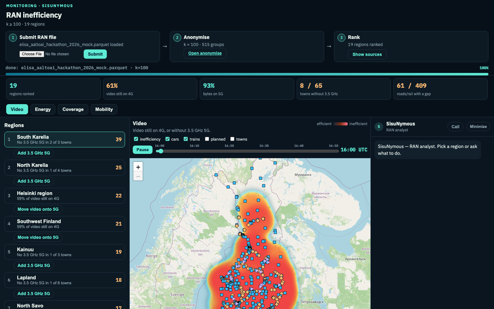

# Monitoring · SisuNymous

Privacy-preserving release of telecom cohort data, stress-tested against a simulated attacker.

Live: **https://fip-195-148-31-126.kaj.poutavm.fi:8790/**

Submit a RAN `.parquet`. It is turned into groups of at least 100 people. The desk ranks video, energy, coverage and mobility. SisuNymous answers only from that release.



All numbers below come from a fabricated Elisa dataset. None of them describe real Elisa customers or network conditions.

## Summary

SisuNymous turns a large telecom dataset into aggregate statistics that can be released without exposing any individual subscriber. On 1,099,340 rows from 199,195 subscribers, we group people into cohorts and publish only cohort means, never raw records.

The core method is k-anonymity at k = 100, with two additions that make it hold up on telecom data. The more important is a **nonzero-support gate**, which closes a blind spot where sparse usage fields pass a standard k-anonymity check while their mean is actually carried by a handful of real users. We built a three-tier simulated attacker and measured it. The gate cut the attacker’s hit rate on sparse fields from roughly 79% down to the level of random guessing, and we documented the cost this incurs rather than hiding it.

## The problem

A telecom operator holds detailed per-subscriber records: location, radio network, application category, data usage, and network quality. This is useful for service quality across regions, but it cannot be released as-is without putting individuals at risk.

The standard answer is to group people and publish only group averages. The catch is that a naive grouping rule can look safe while quietly leaking the people it is meant to protect. This project finds where that happens on telecom data and fixes it with evidence.

## Approach

We remove all direct identifiers (MSISDN, IMSI, IMEI, and cell ID) and timestamps, then group subscribers by province, radio access type, and application category. For each cohort we publish the mean of throughput, latency, and data volume. Every published number is backed by at least 100 distinct subscribers.

**A three-level pooling rule** handles cohorts that are too small. When a group cannot reach 100 people, it is merged step by step: first application categories, then a combined bucket, then sparse provinces into “Other provinces” within the same network. The release stays one non-overlapping partition, which matters for the differencing test.

**A nonzero-support gate** is the key addition. A field is released for a cohort only when at least 100 subscribers have a value greater than zero. If fewer than 100 do, the field is withheld. That shifts the guarantee from “at least 100 people are in this group” to “at least 100 people actually contribute to this number”.

## The blind spot

Standard k-anonymity counts people with a non-null value. On telecom usage data that hides a flaw: many usage fields are extremely sparse. In this file 99.7% of video-usage values are zero and 98.9% of audio-usage values are zero. Almost every subscriber has a non-null value of exactly 0, so a “non-null people ≥ 100” check always passes.

Only 3,388 subscribers in the whole file ever used video. A cohort can clear the 100-person bar while its mean is carried by a handful of real users. The published mean, multiplied by the public row count, can reconstruct those few people’s usage. The check reports the cohort as safe. It is not. The nonzero-support gate is the fix.

## Validation

Every design choice was treated as a hypothesis to test. The attacker code reads the source in memory only to compute ground truth, writes no identifier-bearing files, and outputs only aggregate statistics.

**Tier 1, singling out.** Can an attacker isolate one subscriber from quasi-identifiers? In the source, 8.167% of rows can be singled out under a “time plus cell plus application plus network” signature. In the release this is 0%. The smallest group contains 124 subscribers.

**Tier 2, attribute inference.** Suppose the attacker already knows which cohort the victim belongs to, and guesses the published mean as the victim’s value. Hit rate is the share of guesses within a relative error of the true value, compared with guessing the global mean. Near baseline means the release adds little inference power. Far above baseline means the field is leaking.

**Tier 3, differencing.** If more than one aggregate table were published, an attacker could subtract them. We verify that the release is a single non-overlapping partition, and we simulate what would leak if a coarser table were also published.

## Results

Before the gate, an attacker guessing the mean of a sparse field hit the true value in about 79% of cases, because so many cohort means were exactly 0. After the gate, the hit rate on those fields falls to random guessing.

| Field | Hit rate at ±10%, before → after (baseline) |
|---|---|
| video | 79.8% → 0.0% (baseline 0.0%) |
| audio | 78.8% → 0.5% (baseline 0.2%) |
| throughput | 8.6% → 8.6% (baseline 1.9%) |
| latency | 11.2% → 11.2% (baseline 10.6%) |
| volume | 2.1% → 2.1% (baseline 0.6%) |

After the rule, no released field sits more than 7 percentage points above its baseline. The shipped release contains 528 cohorts, retains all 1,099,340 rows, and has a minimum of 124 contributors per cohort.

Network-quality metrics such as latency, retransmission, and RTT carry very little privacy cost (hit rates within 7 points of baseline). They describe the network rather than a person. The fields that need care are the sparse behavioural ones (video, audio) and the sparse quality field HTTP response time.

### The cost

Closing the leak is not free. The main casualty is 2G. Only 0.3% of rows are 2G, and 83.2% of their throughput values are zero, so most 2G province slices cannot supply 100 nonzero contributors. Six provinces are merged into “Other provinces” for 2G, so **2G can no longer be read at province level**. The worst single-slice error rises from 0.154% to 50.36%.

One acceptance metric, overlap of the ten lowest-throughput regions, returns to 10/10 after pooling partly because the merged slices all sink to the bottom together. A metric passing is not the same as a problem being solved.

### Privacy and utility by k

| | k=5 | k=20 | k=100 (shipped) |
|---|---|---|---|
| Cohorts | 728 | 598 | 528 |
| Smallest equivalence class | 5 | 27 | 124 |
| Worst-cohort hit rate at ±10% (baseline) | 80.0% (0.0%) | 27.6% (20.7%) | 21.2% (0.0%) |
| Worst slice relative error | 0.16% | 47.86% | 50.36% |

Raising k lowers the worst-cohort hit rate, from a homogeneity failure at k=5 (five people with near-identical values, 80% hit rate) down to 21% at k=100. Higher k also merges more provinces. On this data, k=100 buys stronger privacy by spending 2G province detail.

## What planning still gets

On the same mock file the desk ranks the network from the release only:

- 61% of video sessions still on 4G. Video should not sit on 2G.
- 8 of 65 sampled towns have no 3.5 GHz 5G. South Karelia is first.
- 2G is on at every sampled place and carried 0.19 GB in the whole window. That is wasted energy.

If video is on 2G or 4G, the next question is coverage (missing 3.5 GHz) or energy (radios left on for almost no traffic). If 3.5 GHz is already on the map and video is still on 4G, that is unused capacity, not a hole in coverage.

## Limitations

SisuNymous provides k-anonymity but not **l-diversity**. A cohort of 100 people with near-identical values still leaks each value through the mean. Even at k=100 the worst cohort sits 21 points above baseline. Higher k does not control homogeneity.

It does not use **differential privacy**. That is defensible for one release over one non-overlapping partition at one threshold. It would need to be revisited for repeated releases.

The attacker model is bounded. The hit-rate unit is a row rather than a subscriber, the tolerance bands are 10 / 25 / 50%, and we did not build the auxiliary-information attacker that combines public population and coverage data. We also did not bound how many rows a single subscriber can contribute to a mean.

## Future work

Add an l-diversity or distributional guarantee for numeric fields so homogeneous cohorts are caught. Introduce differential privacy for repeated releases. Build the auxiliary-information attacker. Releasing sparse fields (video, audio, HTTP metrics) at a coarser cohort key would recover some of the utility currently withheld.

## Run

```bash
python3 -m venv .venv
source .venv/bin/activate
pip install -r requirements.txt
./run.sh
```

Open http://127.0.0.1:8790 and submit a RAN file. The desk stays empty until you do.

Optional: `cp .env.example .env` and add `ELISA_LLM_KEY` if you want Mistral chat. Local Ollama models work on the Anonymise page if Ollama is running.
